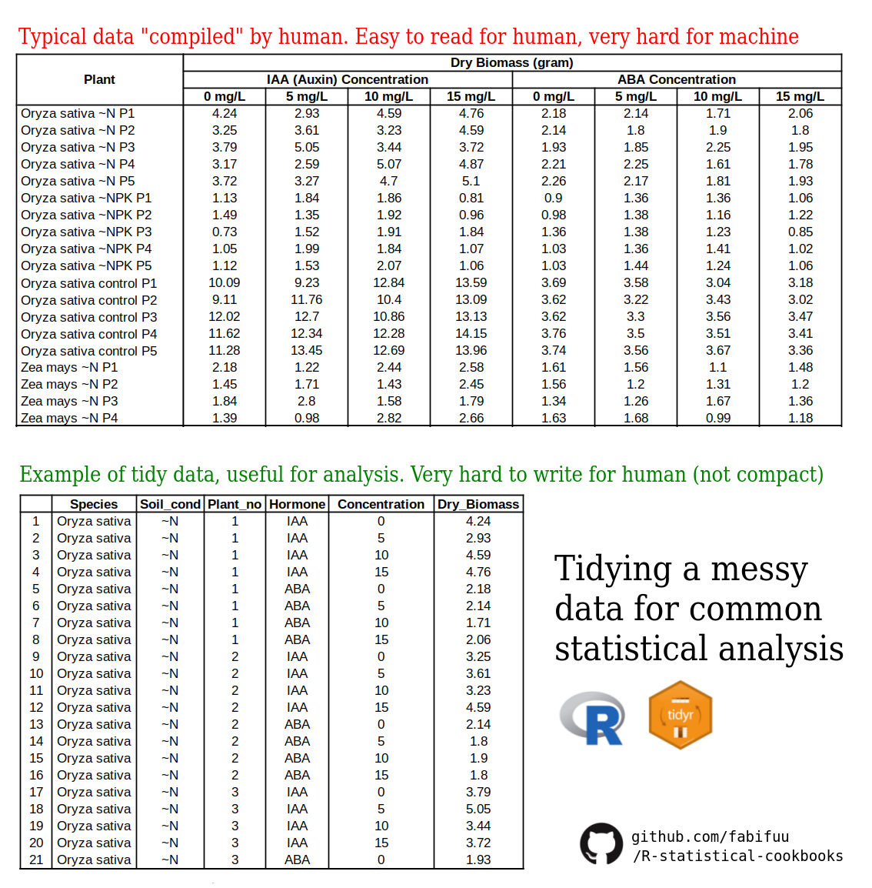
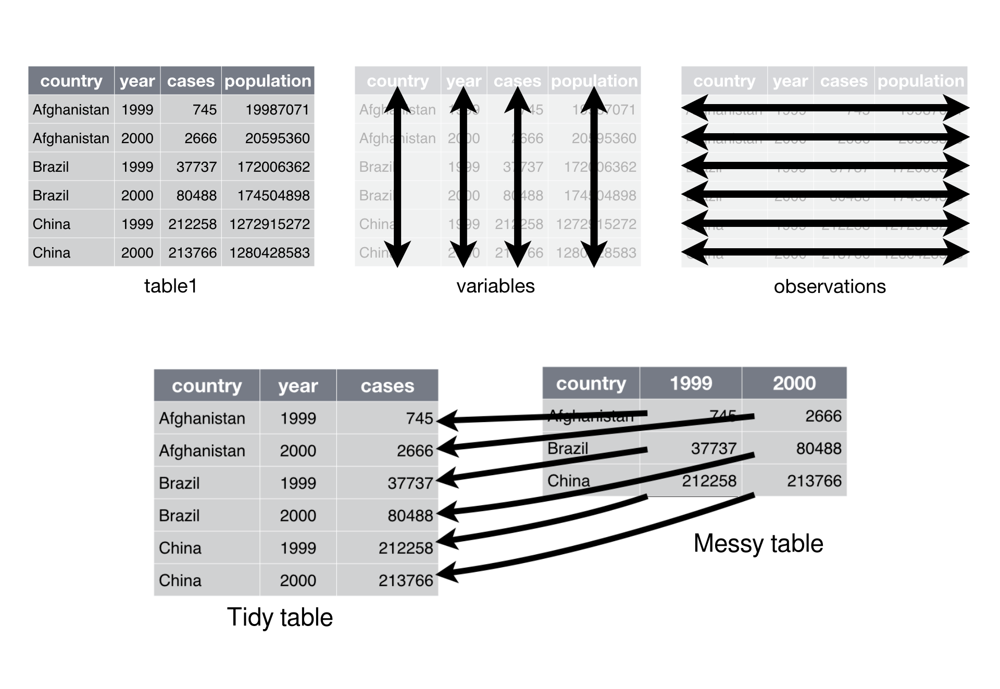

# R Statistical Cookbooks
Assortment of R code for common life science statistical computation (excluding bioinformatics) and data visualization. 

## Preface
Statistics and data visualization are the heart in life science. Complexity of biological data can be described in simple, shorter, yet meaningful statistical analysis. R, maybe not incidentally, become synonymous with statistics and data analysis, especially with life science. However, many biology and life science student still don't understand how R works and how to visualize data properly and beautifully. In this repository, I will guide you towards R world and its application in common statistical analysis, tailored towards life science data. Keep in mind that this project is my own method to learn R and statistics. Thus, this project will be on-going for god knows.

## Who is this repository for?
This repository is for whomever want to learn R and statistics! However, since I am a noob, logically it follows that the main audience of this repository are also noobs. Yes, it is beginner friendly and contain detailed comment in every operation!

## Tidy and Descriptive: Wrangling and Cleaning Data
In biology, experiment results usually compiled by hand. It's not always the case that experimental data are given by computer, except for bioinformatics-related experiment such as genomics analysis, RNA-seq, etc. (that's why I spesifically mentioned that this repository exclude bioinformatics). This the "usual" scenario: you make a sheet of paper containing a blank table, and you measure something for certain period of times. Whether it's the height of a plant, Ct value of qPCR, or abundance of certain species, the data that you have compiled are **easy for you to write and read**.  However, this type data are, for obvious reason, **very hard** for computer to read! You have three header stacking on top of each other, with no proper column variable! (See picture below). Indeed, the very first obstacle for us to do R in data analyis are the difficulty of wrangling and cleaning a data set before actual statistical analysis and data visualization began.

Here I will explain to you a paradigm of **tidy data**. Initially, it was devised by Hadley Wickham, the godfather of R package "Tidyverse", in *Journal of Statistical Software* (August 2014, Volume 59, Issue 10). In R, tidying a messy data can be done easily with TidyR package. Tidy data is a standard way of mapping the meaning of a dataset to its structure. A dataset is messy or tidy depending on how rows, columns and tables are matched up with observations, variables and types. In tidy data:

1. Each variable forms a column.
2. Each observation forms a row.
3. Each type of observational unit forms a table.

Messy data is any other arrangement of the data that doesn't obey the rule above. Here is the illustration of messy data and tidy data.

You can learn a lot more of tidying a messy data in [R for Data Science](https://r4ds.had.co.nz/tidy-data.html) or [TidyR](https://tidyr.tidyverse.org/).

## Simple Error Bar: Presenting the Uncertainty

## Simple T Test

## Simple ANOVA (One and Two-way)

## Post-Hoc ANOVA
### Tukey Test HSD
### Holm’s Method
### Dunnett’s Correction

## Non-Parametric Statistical Inference
### Wilcoxon signed-rank test
### Mann–Whitney U test
### Kruskal Wallis
### Friedman Test

## Significant Asterisks

## Beyond ANOVA: ANCOVA, MANOVA, MANCOVA

